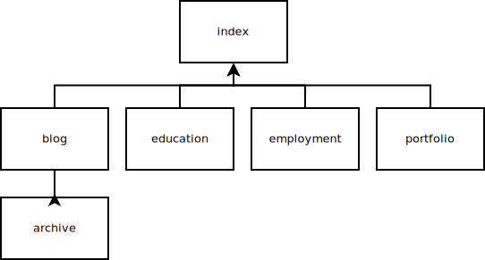

# Design Reflections

## Sitemap

## Reflection

#### What are the 6 Phases of Web Design?
  1. Information Gathering
  2. Planning
  3. Design
  4. Development
  5. Testing and Delivery
  6. Maintenance

#### What is your site's primary goal or purpose? What kind of content will your site feature?

My sites primary goal will be to introduce myself to potential employers. The site will feature content such as education, previous projects, and blog posts.

#### What is your target audience's interests and how do you see your site addressing them?

The target audience is interested in finding developers that can solve the problems they have at their company. My site will demonstrate to them that I have competency and experience in the areas where they have problems.

#### What is the primary "action" the user should take when coming to your site? Do you want them to search for information, contact you, or see your portfolio? It's ok to have several actions at once, or different actions for different kinds of visitors.

The primary action the user should take is to contact me with requests.

#### What are the main things someone should know about design and user experience?

Developers should know that design and user experience are not the same thing. Developers should know that design can be about layout and
user experience is about how the user feels while using the site.

#### What is user experience design and why is it valuable?
User Experience is how the user feels as they are using the web site. This is important because how the user feels will drastically affect how the user behaves. If a user is confident, then they may be willing to explore the site more. If they are less confident, they may leave the site altogether.

#### Which parts of the challenge did you find tedious?

I didn't find any part of this challenge tedious.
