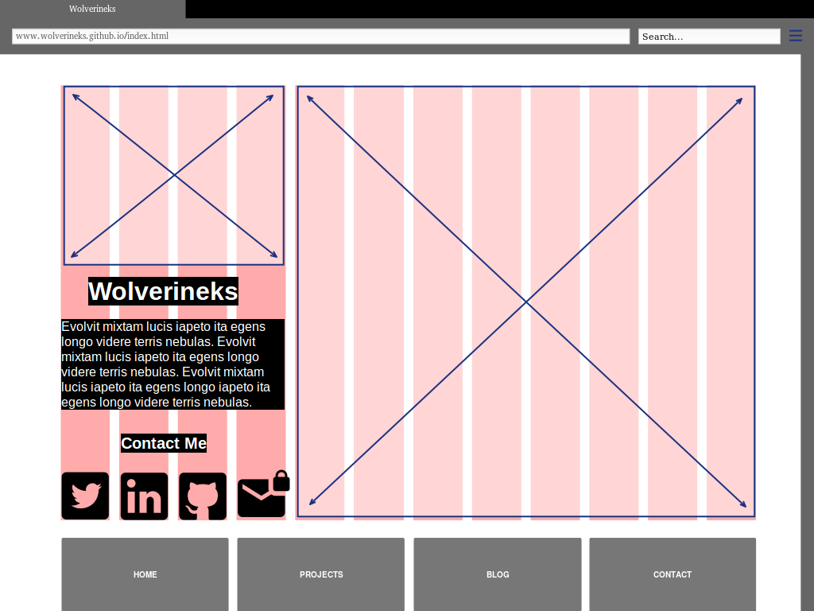
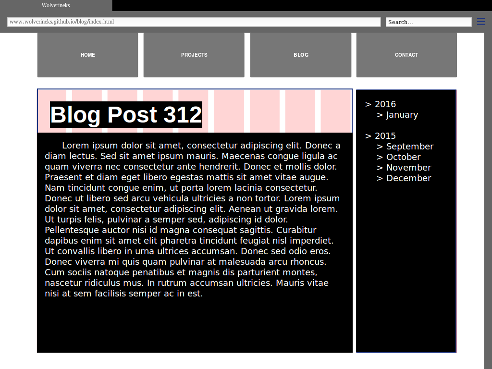

# Wireframe Reflection
## Images
#### index.html

#### blog/index.html

## Reflection
  #### What is a wireframe?
  * A wireframe is a skeleton version of a website. It contains very few details, as it is created early in the development cycle. It contains generic placeholders to convey the initial layout design. It may contain placeholders for elements like headers, footers, navigation, images, and text boxes.

  #### What are the benefits of wireframing?
  * Wireframing can help illustrate how the layout will contribute to the initial goals of the web site. They are also a fast and easy way to prototype and iterate.

  #### Did you enjoy wireframing your site?
  * The process of wireframing was straightforward and fun. the frustrating part was to wireframe without much direction or content.

  #### Did you revise your wireframe or stick with your first idea?
  * I made several changes to the layout of the index for both pages after completing an initial version.

  #### What questions did you ask during this challenge? What resources did you find to help you answer them?
  * I asked myself who were the people that I was targeting with this website and what content are they going to be interested in. Additionally, how can I optimize the site to guide them to the call to action. I looked at a handful of portfolio sites for inspiration and design options.

  #### Which parts of the challenge did you enjoy and which parts did you find tedious?
  * I enjoyed imagining the customers point of view and playing around with ideas on how to design for them. I found it tedious trying to find and use a program that made the wireframing process easier. Perhaps I should just stick to pencil and paper next time.
