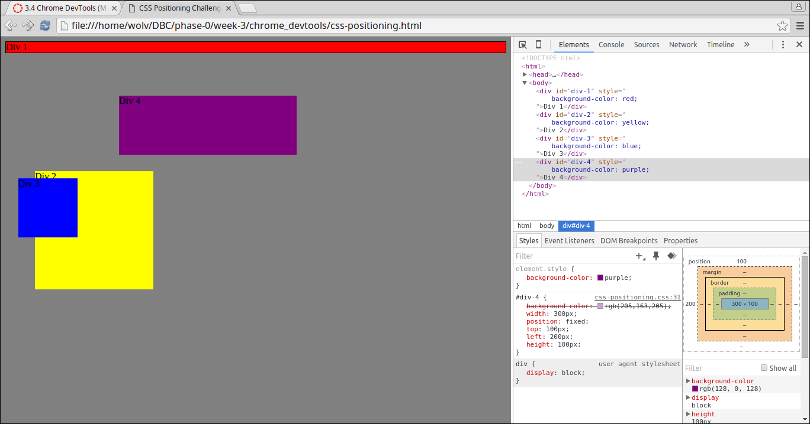
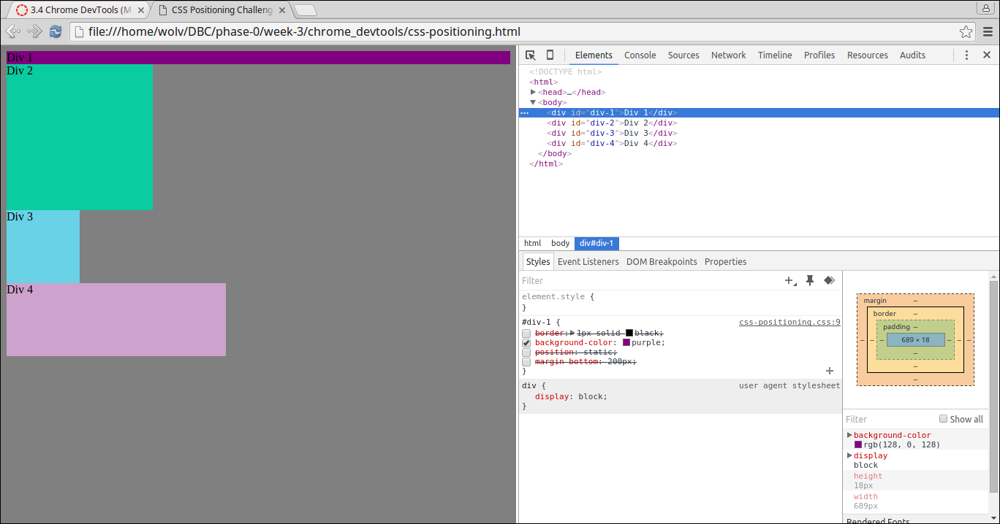
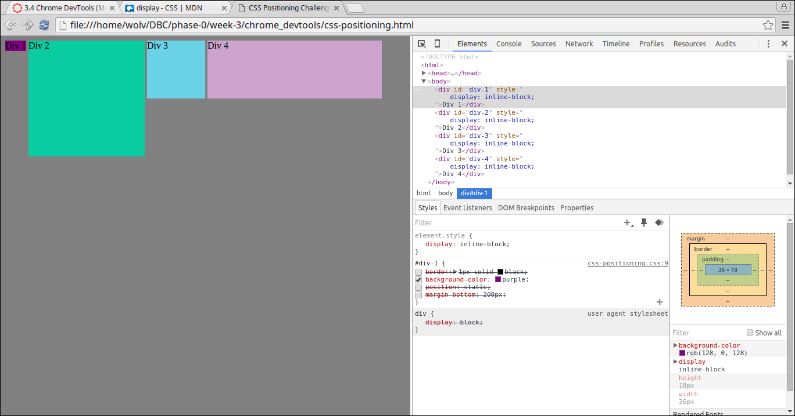
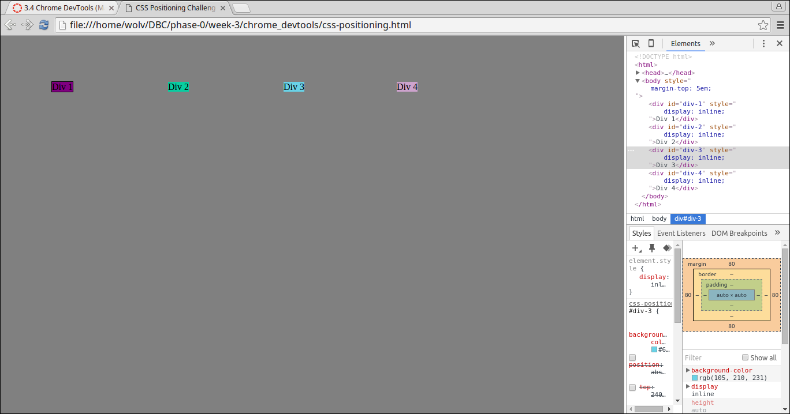
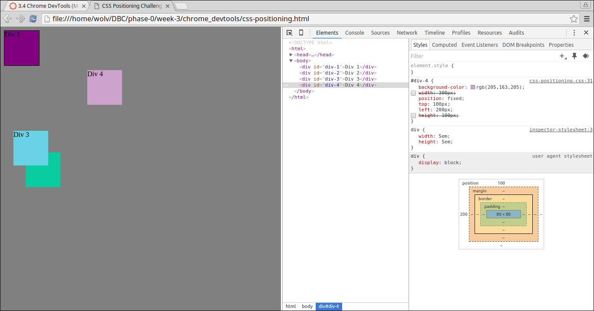
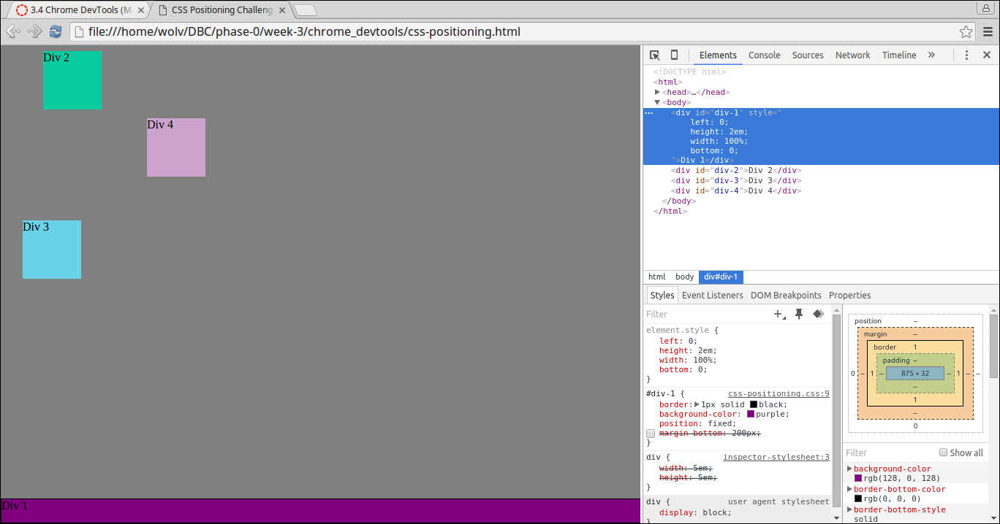
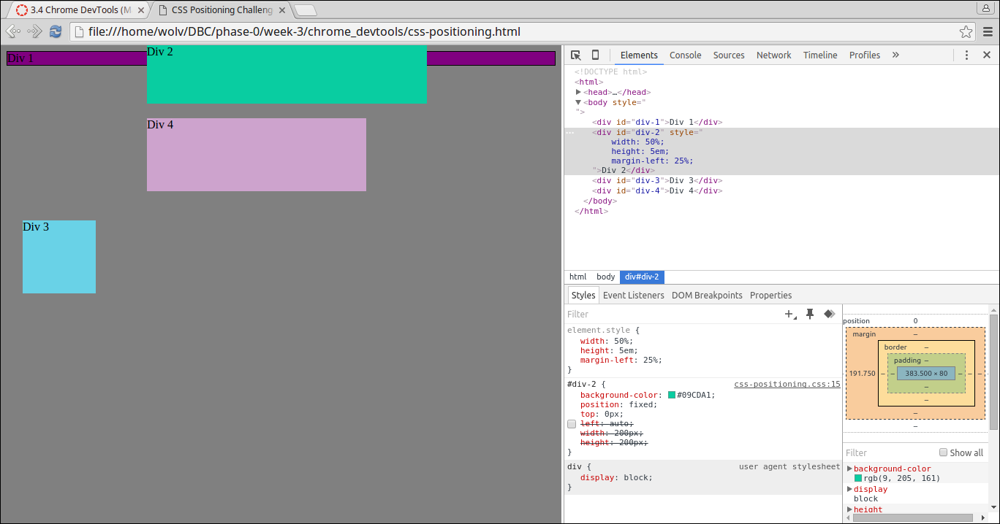
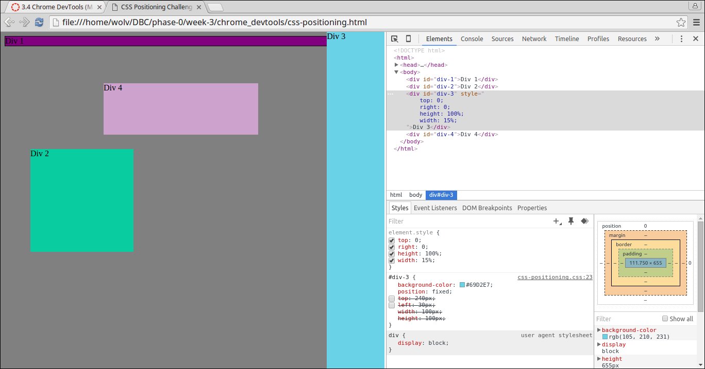
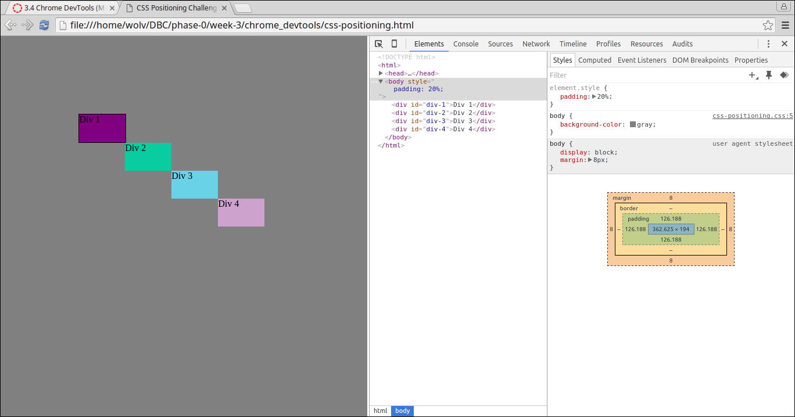

# Positioning Reflection

#### Changing Colors

#### Column

#### Row

#### Make Equidistant

#### Squares

#### Footer

#### Header

#### Sidebar

#### Get Creative

**How can you use Chrome's DevTools inspector to help you format or position elements?**
  * In Chrome DevTools, you can easily manipulate the position and format of elements, by adding CSS rules into the element.style box. This applies the specified changes to the element's style live in the browser window, and override the current styling rules.

**How can you resize elements on the DOM using CSS?**
  * Under element.style box, we used the following CSS rules: width, height. We used both measurement units of ems and pixels to specify the width and height of the element (e.g. width: 5ems).

**What are the differences between absolute, fixed, static, and relative positioning? Which did you find easiest to use? Which was most difficult?**
  * Static is the default display property. It follows the flow of the HTML document.
  * Absolute dominates all other positioning rules, placing the element exactly where you specify by using left, right, top, and bottom. Absolute positioning still scrolls with the page.
  * Fixed is similar to absolute, except these elements will not scroll with the page.
  * Relative positioning moves the element the specified units away from the default position of the element.

  Each positioning method has a useful purpose. The fixed positioning was easiest and most intuitive. You set the top, bottom, left and right, and the element remains exactly where you left it.

  I found the static positioning method to be least intuitive. It makes changes to the elements automatically without any indication as to how it will change the elements.

**What are the differences between margin, border, and padding?**

  If your webpage was a plate of food, the margin is the distance between the border of the plate and the border of any other plates, the border is the design around the edge of your plate, and the padding is the distance between the food in the plate and the border.

**What was your impression of this challenge overall? (love, hate, and why?)**

  The exercise was very clear, and the screenshots made it very easy to follow the instructions. It was very informative regarding moving elements around on the page and positioning them relative to other elements.
