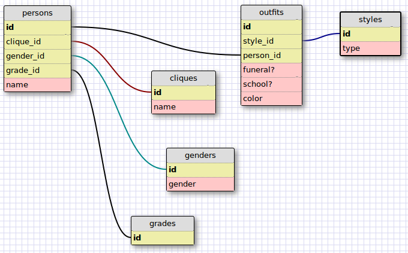

## SQL Commands
-- 1. Select all data for all states.

SELECT *
FROM states;

-- 2. Select all data for all regions.

SELECT *
FROM regions;

-- 3. Select the state_name and population for all states.

SELECT state_name,
       population
FROM states;

-- 4. Select the state_name and population for all states ordered by population.
-- The state with the highest population should be at the top.

SELECT state_name,
       population
FROM states
ORDER BY population DESC;

-- 5. Select the state_name for the states in region 7.

SELECT state_name
FROM states
WHERE region_id = 7;

-- 6. Select the state_name and population_density for states with a population
-- density over 50 ordered from least to most dense.

SELECT state_name,
       population_density
FROM states
WHERE population_density > 50
ORDER BY population_density ASC;

-- 7. Select the state_name for states with a population between 1 million and
-- 1.5 million people.

SELECT state_name
FROM states
WHERE population > 1000000
  AND population < 1500000;

-- 8. SELECT the state_name AND region_id FOR states ordered BY region IN
-- ascending order.

SELECT state_name,
       region_id
FROM states
ORDER BY region_id ASC;

-- 9. SELECT the region_name FOR the regions WITH "Central" IN the name.

SELECT region_name
FROM "main"."regions"
WHERE region_name LIKE '%Central%';

-- 10. Select the region_name and the state_name for all states and regions in
-- ascending order by region_id. Refer to the region by name. (This will involve
-- joining the tables).

SELECT state_name,
       region_name
FROM states
INNER JOIN regions ON states.region_id=regions.id
ORDER BY region_id ASC;

## Database Scheme

## Reflection

* What are databases for?

Databases are for storing large amounts of data, that you will likely want to access at a later time.

* What is a one-to-many relationship?

A One-to_Many relationship, is the relationship you define between 2 tables, when several entries in one of the tables are associated with a single entry on the other table.

* What is a primary key? What is a foreign key? How can you determine which is which?

The primary key is the id of the entry.
The foreign key is the id of an entry in another table, which the current entry is associated with.

* How can you select information out of a SQL database? What are some general guidelines for that?

You can select information out of a SQL database by using sql statements in a sql program (e.g. SELECT * FROM States;). You can find example sql statements at [SQL Quick Reference From W3Schools](http://www.w3schools.com/sql/sql_quickref.asp)
