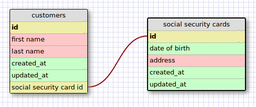
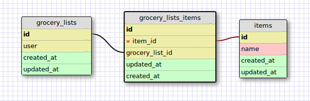

## Relationship Types

### One-to-One

### Many-to-Many

## Reflections

* What is a one-to-one database?

A one-to-one database is a database where each entry in a table is associated with only 1 entry in another table, and vice versa.

* When would you use a one-to-one database? (Think generally, not in terms of the example you created).

A one-to-one database is useful if you have a bunch of columns for each and you want to split it up.

* What is a many-to-many database?

A many-to-many database is a database where multiple entries in a table are associated with multiple entries in another table, and vice versa. A join table is used to associate the 2 tables.

* When would you use a many-to-many database? (Think generally, not in terms of the example you created).

A many-to-many database is useful if you have multiple entries in one table that are associated with multiple entries in another table, and vice versa. This could be something along the lines of each user has many awards, and each award has been awarded to many users.

* What is confusing about database schemas? What makes sense?

Nothing is confusing about databases this far. It makes sense that you want to have preformatted lists of important information, and have them associated with each other.
